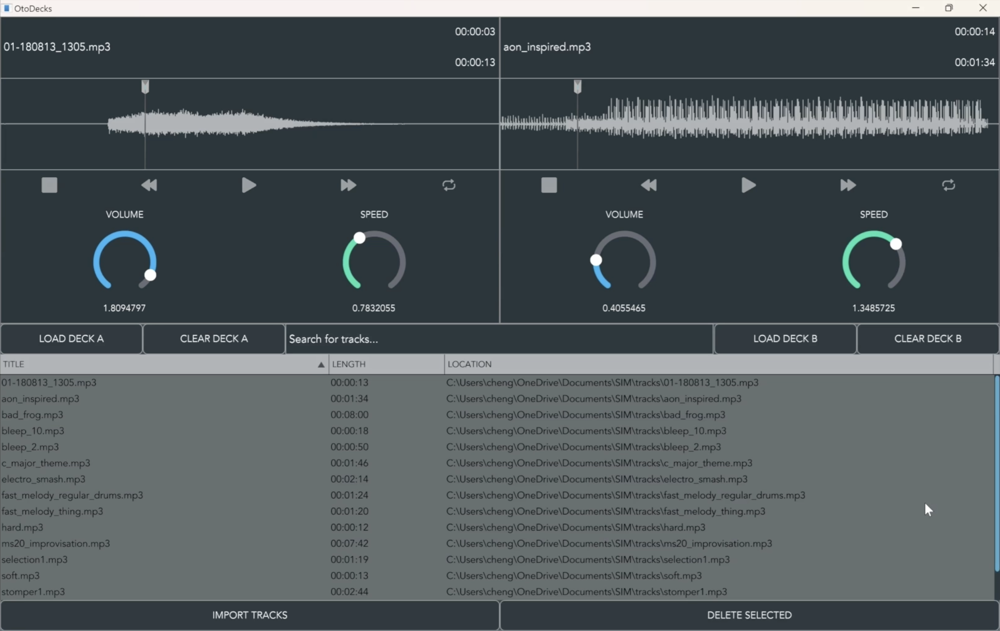

# OtoDecks

## About

OtoDecks is a DJ application developed in C++ using the JUCE application framework. It consists of a playlist for users to import their tracks, as well as two decks for users to play back their tracks using a variety of effects.
